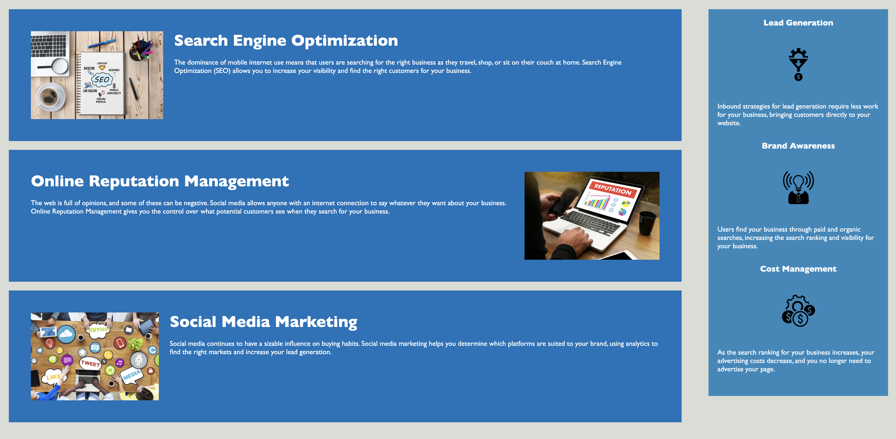

# Bootcamp_02_Homework
First homework for bootcamp. HTML, CSS, and Git: Code Refactor.

For this homework:

I made sure that all links function correctly within the codes.

I consolidated and organized the website's CSS selectors and properties to follow semantic structure.

I try to make sure that the CSS file is properly commented.

I deployed the website to a live URL and it loads with no errors.

Here are some screenshots from the completed homework.

Here is the link to active website: https://bxz5089.github.io/Bootcamp_02_Homework/